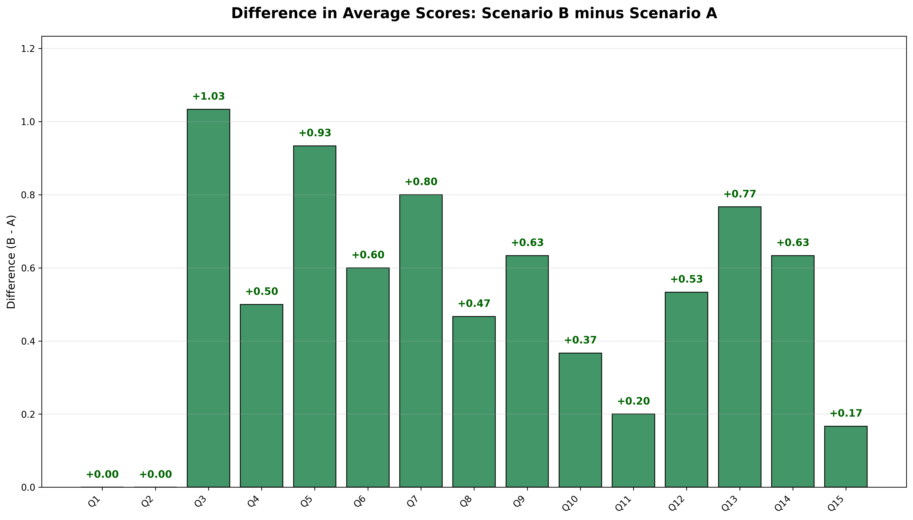
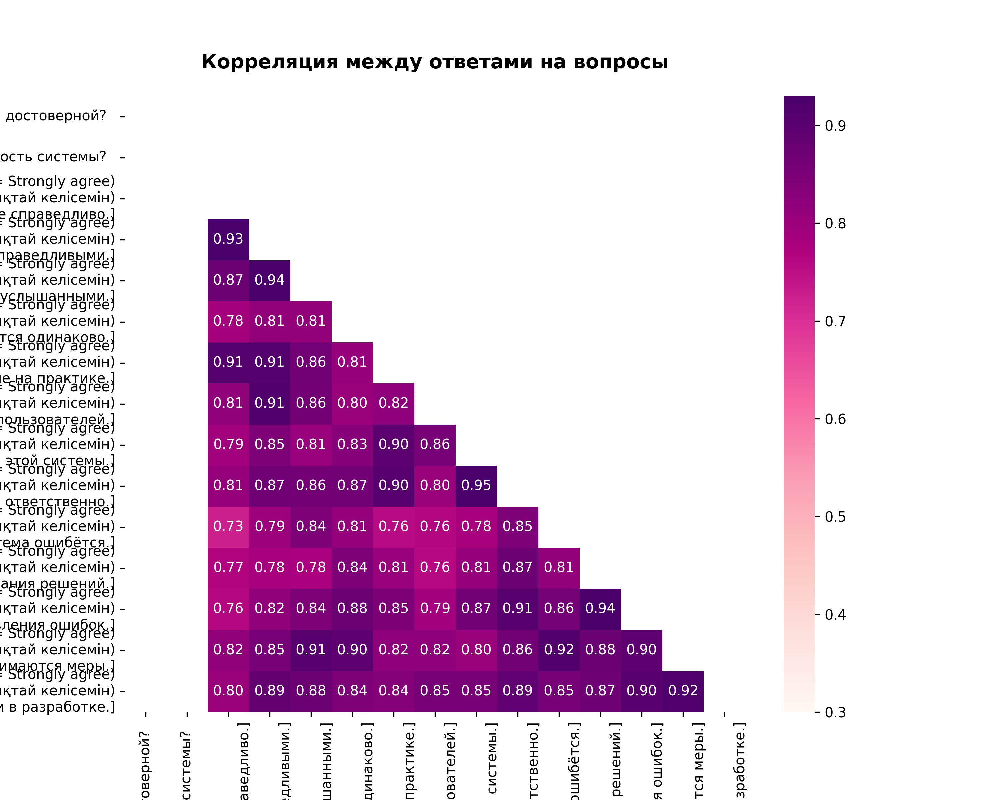
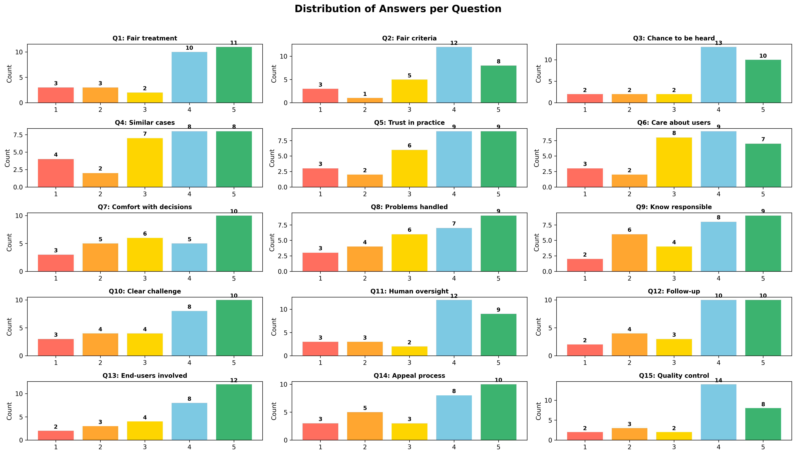
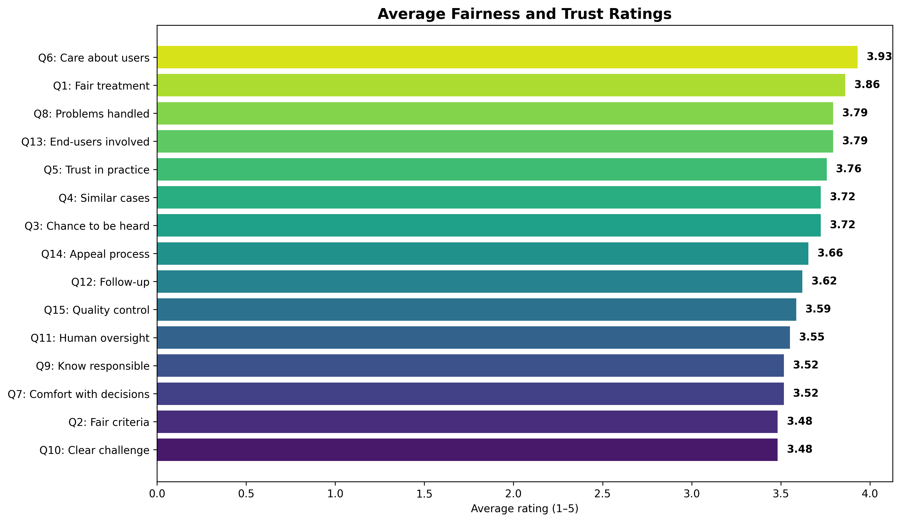
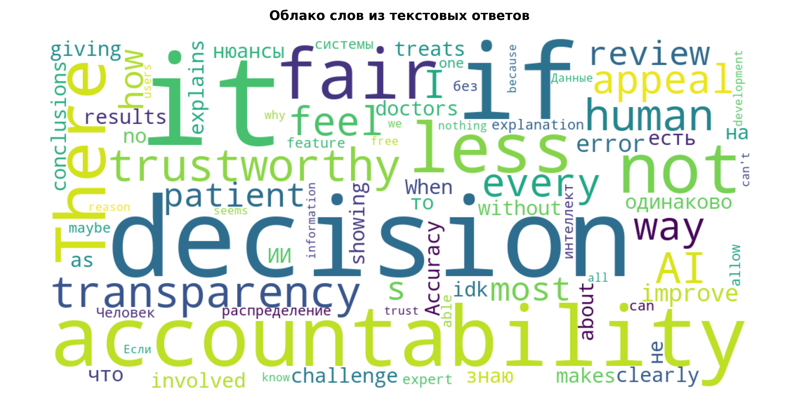

```markdown
# 🧮 Survey Data Analysis (Scenario A vs Scenario B)

This project analyzes survey data comparing two different scenarios (A and B) and visualizes the results.  
The script automatically performs data processing, statistical tests, and generates a set of visual reports saved as image files.

---

## 📂 Project Structure

```

📁 project/
│
├── main.py                # Main analysis script
├── Новая форма.csv        # Source survey data file
├── README.md              # Documentation
│
├── comparison_AB.png      # Average score comparison (Scenario A vs B)
├── difference_AB.png      # Score difference (B - A)
├── correlation_matrix.png # Correlation heatmap between questions
├── answers_distribution.png  # Distribution of answers for all questions
├── mean_ratings.png       # Average fairness & trust ratings
└── wordcloud.png          # Word cloud from open-ended responses

````

---

## ⚙️ Installation & Usage

1. **Install dependencies:**
   ```bash
   pip install pandas matplotlib seaborn numpy scipy wordcloud
````

2. **Make sure the CSV file `Новая форма.csv` is in the same folder as `main.py`.**

3. **Run the script:**

   ```bash
   python main.py
   ```

---

## 📊 What the Script Does

When executed, the script:

1. Loads and cleans the survey dataset.

2. Converts textual answers (e.g., “Agree”, “Neutral”, etc.) into numerical values (1–5).

3. Calculates average scores per question for **Scenario A** and **Scenario B**.

4. Performs a paired t-test to check statistical significance.

5. Generates and **saves multiple graphs**, including:

   * 📈 `comparison_AB.png` — average scores comparison (A vs B)
   * 🟩 `difference_AB.png` — score difference (B − A)
   * 🔥 `correlation_matrix.png` — correlation heatmap
   * 📊 `answers_distribution.png` — response distribution per question
   * 🌈 `mean_ratings.png` — average ratings summary
   * ☁️ `wordcloud.png` — word cloud from text responses

6. Displays summary results and significance tests in the terminal.

---

## 📈 Visualization Examples

| Type                     | Example                                            |
| ------------------------ | -------------------------------------------------- |
| Scenario Comparison      |                |
| Score Difference (B − A) |                |
| Correlation Heatmap      |      |
| Answer Distribution      |  |
| Average Ratings          |                  |
| Word Cloud               |                         |

---

## 🧠 How to Interpret the Results

* **Green bars on the “Difference (B − A)” chart** show where Scenario B scored higher than A.
* **The correlation heatmap** reveals relationships between how questions were answered.
* **The average rating chart** highlights overall perceptions of fairness and trust.
* **The word cloud** summarizes frequent terms mentioned by respondents in open-ended comments.

---

## 🧩 Possible Improvements

* Add filtering by demographics (age, gender, profession).
* Automatically save all charts to a dedicated `/graphs/` folder.
* Generate an interactive HTML or PDF report.
* Add regression or clustering for deeper insight.

---

## 👨‍💻 Author

**Data Analysis Script by Raiymbek Serikkali**
📅 2025
📊 Built with: Python • Pandas • Matplotlib • Seaborn • WordCloud

```
